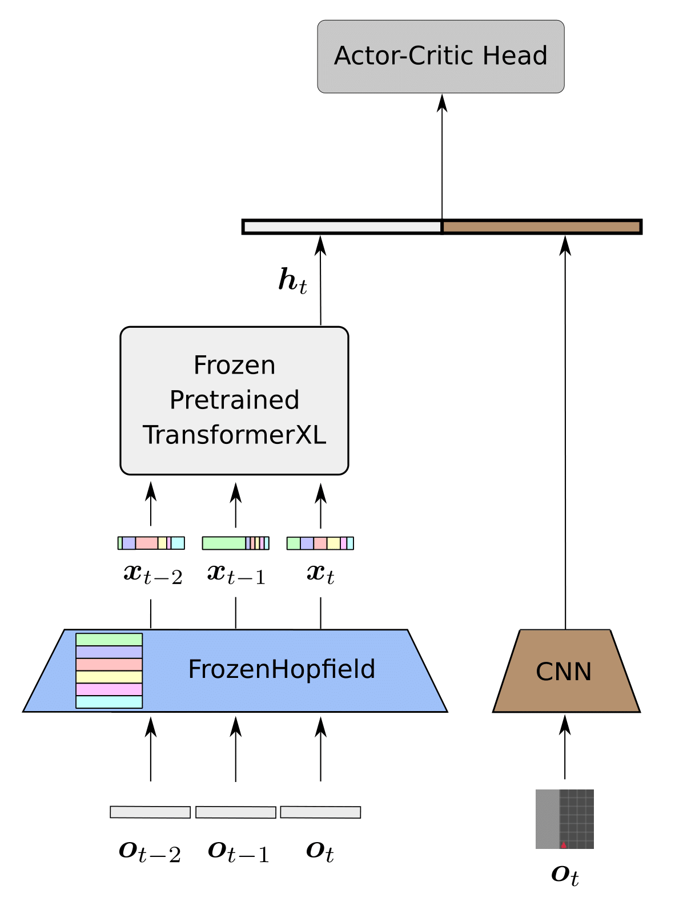
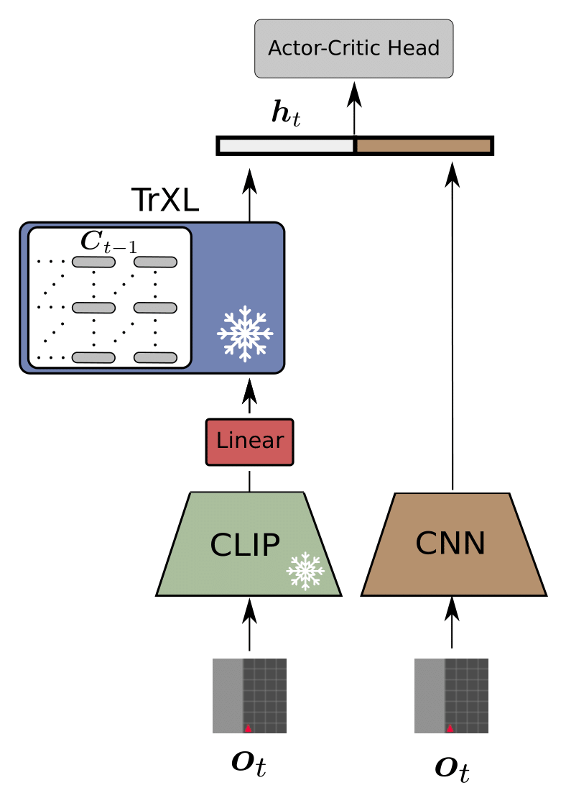

# History Compression via Language Models in Reinforcement Learning


This repository contains the code for the papers:
- **[History Compression via Language Models in Reinforcement Learning (HELM)](https://arxiv.org/abs/2205.12258)**
- **[Toward Semantic History Compression for Reinforcement Learning (HELMv2)](https://openreview.net/forum?id=97C6klf5shp)**
- **[Semantic HELM: An Interpretable Memory for Reinforcement Learning (SHELM)](https://arxiv.org/abs/2306.09312)**

## HELM

Fabian Paischer<sup>1 2</sup>,
Thomas Adler<sup>1</sup>,
Vihang Patil<sup>1</sup>,
Angela Bitto-Nemling<sup>1 3</sup>,
Markus Holzleitner<sup>1</sup>,
Sebastian Lehner<sup>1 2</sup>,
Hamid Eghbal-zadeh<sup>1</sup>,
Sepp Hochreiter<sup>1 2 3</sup>

<sup>1</sup> LIT AI Lab, Institute for Machine Learning, Johannes Kepler University Linz, Austria</br>
<sup>2</sup> ELLIS Unit Linz  
<sup>3</sup> Institute of Advanced Research in Artificial Intelligence (IARAI)


<p align="center">
  
</p>

 
HELM leverages pretrained language encoders as a memory component for partially observable environments.
Thereby, it uses a modern Hopfield Network to map observations to language tokens.

**A detailed blog post on HELM is available at [this link](https://ml-jku.github.io/blog/2022/helm/).**


To reproduce the HELM baseline, first clone the repository and install the conda environment by

    git clone https://github.com/ml-jku/helm.git
    cd helm
    conda env create -f env.yml

After installing the conda environment you can train HELM on the KeyCorridor environment by

    python main.py

A new directory `./experiments/HELM/MiniGrid-KeyCorridorS3R1-v0` will be created in which all log files and checkpoints will be stored.

All changeable parameters are stored in the `config.json` file and can be adjusted via command line arguments as:

    python main.py --var KEY=VALUE

For example, if you would like to train on `RandomMaze-v0`:

    python main.py --var env=RandomMaze-v0

or on the Procgen environment `maze`:

    python main.py --var env=maze

**Note** that by default the Procgen environments are created in the *memory* distribution mode, thus only the six environments 
as mentioned in the paper can be trained on, all others do not support the *memory* mode.
By default a Tensorboard log is created.

## HELMv2

Fabian Paischer<sup>1 2</sup>,
Thomas Adler<sup>1</sup>,
Markus Hofmarcher<sup>1 2</sup>,
Andreas Radler <sup>1</sup>,
Sepp Hochreiter<sup>1 2 3</sup>

<sup>1</sup> LIT AI Lab, Institute for Machine Learning, Johannes Kepler University Linz, Austria</br>
<sup>2</sup> ELLIS Unit Linz  
<sup>3</sup> Institute of Advanced Research in Artificial Intelligence (IARAI)

<p align="center">
  
</p>


HELMv2 replaces the random projection of HELM with a pretrained CLIP encoder.
Further it employs ad adopted and fixed batchnorm layer to project the visual observations to the language space.
The mapping to the language space for HELM and HELMv2 are arbitrary, i.e., no semantics are transferred to the language space.

You can find the trainer file for HELMv2 [here](trainers/helmv2_trainer.py).

To reproduce our results on the MiniGrid environments, simply run

    python main.py --var model=HELMv2 --var env=MiniGrid-RedBlueDoors-6x6-v0

To run HELMv2 on the MiniWorld benchmark suite you will first need to install ```gym-miniworld``` from source:

    git clone https://github.com/maximecb/gym-miniworld.git
    cd gym-miniworld
    git checkout ff61a67
    pip3 install -e .

**Note** that it is vital to check out and install the specified commit from source, since the MiniWorld benchmark suite has undergone significant changes ever since.
Then, to run HELMv2 on MiniWorld simply specify the MiniWorld environment as follows:

    python main.py --var model=HELMv2 --var env=MiniWorld-Sign-v0
    
You can find a comprehensive list of MiniWorld environments [here](https://github.com/Farama-Foundation/Miniworld/blob/ff61a67678eec7d6ca639abbfe4afeaaab8a11a4/docs/environments.md).
If you encounter problems for training on MiniWorld (NoSuchDisplayException)

    xvfb-run -a -s "-screen 0 1024x768x24 -ac +extension GLX +render -noreset" python main.py --var model=HELMv2 --var env=MiniWorld-Sign-v0

More details regarding troubleshooting can be found [here](https://github.com/Farama-Foundation/Miniworld/blob/ff61a67678eec7d6ca639abbfe4afeaaab8a11a4/docs/troubleshooting.md).

If you are interested in the semantic mappings from image to text space introduced in [Toward Semantic History Compression for Reinforcement Learning (HELMv2)](https://openreview.net/forum?id=97C6klf5shp), please also check out [this repo]() which uses these mappings for image-conditioned text generation.

## Semantic HELM

Fabian Paischer<sup>1 2</sup>,
Thomas Adler<sup>1</sup>,
Markus Hofmarcher<sup>1 2</sup>,
Sepp Hochreiter<sup>1 2 3</sup>

<sup>1</sup> LIT AI Lab, Institute for Machine Learning, Johannes Kepler University Linz, Austria </br>
<sup>2</sup> ELLIS Unit Linz  
<sup>3</sup> Institute of Advanced Research in Artificial Intelligence (IARAI)


Semantic HELM utilizes a retrieval mechanism via a pretrained CLIP model to encode an image in the language space.
Particularly, we use the vocabulary of the CLIP language encoder as our semantic database and augment each token with a set of prompts.
Then, we retrieve corresponding tokens given a visual observation as input.
Finally, the text-tokens are fed into the language encoder and represent the memory of an agent.
The memory module of SHELM is intrinsically interpretable, which allows identifying failure cases and facilitates troubleshooting.
SHELM significantly outperforms HELM, HELMv2, and Dreamerv2 on environments that are unsolvable without a memory component.

---

To run experiments with SHELM, you will need to extract the CLIP embeddings for the different environments first, by running

    python prepare_embeddings.py
    
This will store prompt-augmented CLIP embeddings for the different environments, as well as a mapping for tokens appearing in both, the vocabulary of CLIP, and the TrXL in the ```data/``` directory.
After doing so, you can run SHELM by setting ```--var model=SHELM``` on any of the aforementioned environnments.

In order to reproduce our runs on the Psychlab Continuous Recognition task you will need to download and install [deepmind_lab](https://github.com/deepmind/lab) first.
Then, you will need to download the dataset contianing the stimuli used by the continuous recognition environment by executing

    cd data/brady_konkle_oliva2008
    ./download_data.sh
    
Finally, set the ```DATASET_PATH``` in ```ENV_DIR/lib/python3.8/site-packages/deepmind_lab/baselab/game_scripts/datasets/brady_konkle_oliva2008.lua``` to the directory containing the images.
```ENV_DIR``` corresponds to the path of your conda environment.
Now you can set ```--var env=psychlab_continuous_recognition``` to train on the continuous recognition task.

If you encounter issues while trying to run the psychlab tasks (Failed to connect RL API), you will need to install sdl2 for headless rendering:

    conda install -c conda-forge sdl2

You can find all hyperparameters for our psychlab experiments in the paper.

For running experiments on Avalon we used the official codebase of the Avalon environment, which you can find [here](https://github.com/Avalon-Benchmark/avalon).
We will also add the code for these experiments soon.

---

## Reproduction of Paper results

We added all configs for MiniGrid/MiniWorld/Psychlab experiments in the ```configs``` directory.
To reproduce a result in the paper, simply load the corresponding config via the ```--config``` command line argument of the ```main.py``` script.

---

## Running a trained policy

To run a trained policy make sure to first set the ```--var save_ckpt=1``` argument during training.
This stores the best checkpoint in the ```experiments``` directory.
To sample episodes from a trained policy you can then simply execute

    python eval-py --ckpt-path PATH_TO_CKPT_DIR

---

## Stay tuned for the next updates

- All results on Psychlab, Avalon, MiniGrid/MiniWorld
- Visualization of tokens being fed into the memory
- Support for Avalon environment
- Support for BERT-style language encoders
- Inference speedup for HELM-like models

--- 

## LICENSE
MIT LICENSE

---

If you find our papers and code useful, please consider citing HELM,

    @InProceedings{paischer2022history,
      title = 	 {History Compression via Language Models in Reinforcement Learning},
      author =       {Paischer, Fabian and Adler, Thomas and Patil, Vihang and Bitto-Nemling, Angela and Holzleitner, Markus and Lehner, Sebastian and Eghbal-Zadeh, Hamid and Hochreiter, Sepp},
      booktitle = 	 {Proceedings of the 39th International Conference on Machine Learning},
      pages = 	 {17156--17185},
      year = 	 {2022},
      editor = 	 {Chaudhuri, Kamalika and Jegelka, Stefanie and Song, Le and Szepesvari, Csaba and Niu, Gang and Sabato, Sivan},
      volume = 	 {162},
      series = 	 {Proceedings of Machine Learning Research},
      month = 	 {17--23 Jul},
      publisher =    {PMLR},
      pdf = 	 {https://proceedings.mlr.press/v162/paischer22a/paischer22a.pdf},
      url = 	 {https://proceedings.mlr.press/v162/paischer22a.html},
      abstract = 	 {In a partially observable Markov decision process (POMDP), an agent typically uses a representation of the past to approximate the underlying MDP. We propose to utilize a frozen Pretrained Language Transformer (PLT) for history representation and compression to improve sample efficiency. To avoid training of the Transformer, we introduce FrozenHopfield, which automatically associates observations with pretrained token embeddings. To form these associations, a modern Hopfield network stores these token embeddings, which are retrieved by queries that are obtained by a random but fixed projection of observations. Our new method, HELM, enables actor-critic network architectures that contain a pretrained language Transformer for history representation as a memory module. Since a representation of the past need not be learned, HELM is much more sample efficient than competitors. On Minigrid and Procgen environments HELM achieves new state-of-the-art results. Our code is available at https://github.com/ml-jku/helm.}
    }
    
and SHELM

    @article{paischer2023semantic,
        author       = {Fabian Paischer and
                      Thomas Adler and
                      Markus Hofmarcher and
                      Sepp Hochreiter},
        title        = {Semantic {HELM:} An Interpretable Memory for Reinforcement Learning},
        journal      = {CoRR},
        volume       = {abs/2306.09312},
        year         = {2023},
        url          = {https://doi.org/10.48550/arXiv.2306.09312},
        doi          = {10.48550/arXiv.2306.09312},
        eprinttype    = {arXiv},
        eprint       = {2306.09312},
        timestamp    = {Mon, 19 Jun 2023 11:06:52 +0200},
        biburl       = {https://dblp.org/rec/journals/corr/abs-2306-09312.bib},
        bibsource    = {dblp computer science bibliography, https://dblp.org}
        }

